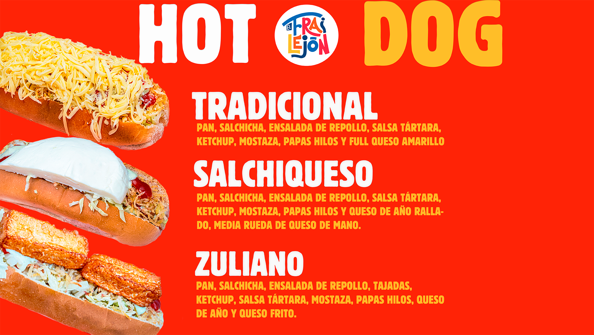
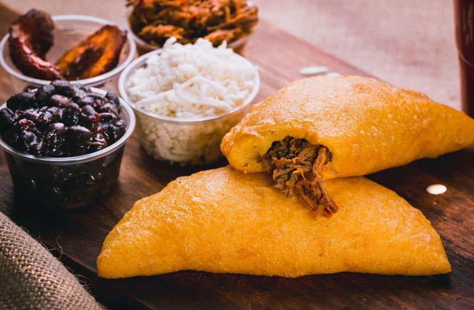
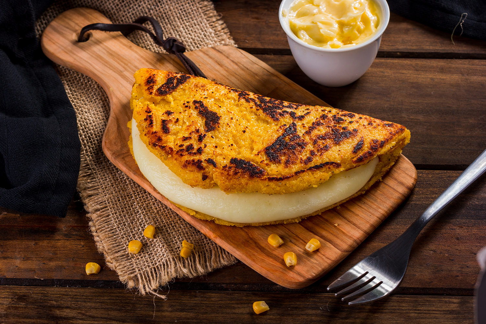

Link de prototipo https://www.figma.com/design/yRYuPKIhZ0Zs3yxLAmMqvp/Prototipo-Proyecto-3?node-id=6-43&t=QfFv3ILATppo6Bgc-1 

En esta, realizamos una página de aterrizaje, también conocida como landing, el cual el usuario al acceder a la página puede observar la interfaz y comprender de qué trata el negocio y sus productos.

Requerimientos

Muestra de los mensajes de negocio
Breve catálogo de productos
Header 
Main 
Products 
Footer De manera opcional y recomendada, que la vista se adapte a móviles

SOLUCION
Se creaon 2 secciones en formato html + un archivo de estilos + archivo de Javascript + carpeta de imágenes. 

1. En el Index creamos un bloque donde van los meta que facilitarán la búsqueda en los buscadores web
<head>
        <meta charset="UTF-8">
        <meta name="viewport" content="width=device-width, initial-scale=1.0">
        <title>El Frailejón</title>
        <meta rel="icon"
            href="https://drive.google.com/file/d/1KLN19J8zW4uT96O0EMyjHRNkSeJAQtxE/view?usp=drive_link"
            type="image/x-icon">
        
        <link rel="stylesheet" href="/style.css">
        <meta itemprop="name" content="El Frailejón" />
        <meta itemprop="url" content="https://elfrailejon.cl" />
        <meta itemprop="description" content="Sabor de casa, sabor venezolano.">
    </head>
2. Creamos el bloque HEADER para cada sección, donde se encuentra el logo y el menú
        <header class="site-header">
            

                

                    

                    <nav>
                        <ul>
                            <li><a href="/index.html">Inicio</a></li>
                            <li><a href="https://menu.fu.do/elfrailejon"
                                    target="_blank"> Pedir</a></li>
                            <li><a href="/ubicacion.html">Ubicación</a></li>
                        </ul>
                    </nav>
                

            

        </header>

3. El bloque MAIN, donde encontramos el carrusel, las categorías y los productos destacados.
   <main>

            

                

                    
                    
                    
                    
                    
                

                <button class="boton izquierda"
                    onclick="cambiarImagen(-1)">&#10094;</button>
                <button class="boton derecha"
                    onclick="cambiarImagen(1)">&#10095;</button>
            

            <h1>Nuestro Menú</h1>

            

                

                    
                    
Empanadas

                

                

                    
                    
Arepas

                

                

                    
                    
Cachapas

                

                

                    
                    
Tequeños

                

                

                    
                    
Perros Calientes

                

                

                    
                    
Pastelitos

                

                

                    
                    
Papas Fritas

                

            

            <h1>Destacados</h1>
            

                

                    
                    <h3>Tequeyoyo</h3>
                    
$2.000

                

                

                    
                    <h3>Empanada Carne Mechada</h3>
                    
$2.000

                

                

                    
                    <h3>6 Tequeñitos</h3>
                    
$5.000

                

                

                    
                    <h3>Mandoquitas</h3>
                    
$1.000

                

            

        </main>
  4. Y finalmente el footer.
<footer>
            
&copy; El Frailejón Sabor Venezolano. Todos los derechos
                reservados.

            
José Joaquín Pérez 467. San Bernardo.

            
Teléfono: +56 95815 3166

            
Síguenos en nuestras redes sociales:
                <a
                    href="https://web.facebook.com/people/El-Frailej%C3%B3n/100087988479196/?mibextid=LQQJ4d">Facebook</a>,
                <a
                    href="https://www.instagram.com/elfrailejoncl">Instagram</a>,
                <a
                    href="https://api.whatsapp.com/send?phone=56958153166&text=Hola%20quiero%20más%20información"
                    target="_blank">
                    WhatsApp
                </a>

            

        </footer>

    
